# Modeling

## Kompetensi Dasar
- (3.18) Memahami konsep gambar teknik dengan komputer

# Pendahuluan [^Daniel_frey]

Salah satu cara terbaik untuk menyampaikan sebuah ide adalah menggunakan gambar. Trutama pada bidang teknik. Dalam perkembangan jaman gambar teknik sangat dimudahkan menggunakan perangkat komputer. 
Perhatikan gambar berikut, dari gambar tersebut akan dibahas secara singkat mengenai dasar dasar gambar teknik.
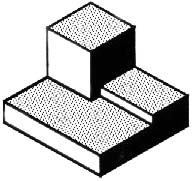

## Gambar Isometrik

Gambar 2 adalah representasi dari gambar Isometrik. Pada gambar isometrik ini, garis vertikal dari objek digambar secara vertikal dan garis horizontal dari objek secara melebar dan mendalam ditampilkan pada sudut 30 drajat ke horizontal. Ketika suatu objek digambarkan menggunakan cara ini, garis yang berparalel dengan ketiga sumbu menggunakan nilai panjang sesungguhnya. Garis yang tidak paralel dengan ketiga sumbu akan menggunakan nilai yang tidak sesungguhnya.

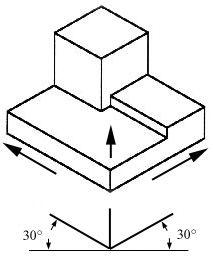

Dalam bidang teknik seharusnya menggambarkan segala bentuk sisi dari suatu objek. Apabila menggunakan cara Isometrik telah mempresentasikan objek sesungguhnya maka cukup menggunakan cara tersebut. Akan tetapi apabila terdapat lubang dibaliknya, maka menggunakan cara Isometrik tidak dimungkinkan.

## Orthographic atau Gambar segala sisi

Bayangkan apabila objek tersebut didalam kotak kaca seperti dibawah.

Apabila gambar objek tersebut digambar dari berbagai sisi dari arahnya masing masing, Akan terbagi menjadi bebrapa bagian gambar. Ini disebut sebagai *Orthographic* atau *Multiview* drawing.

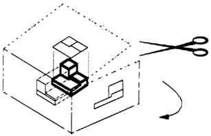
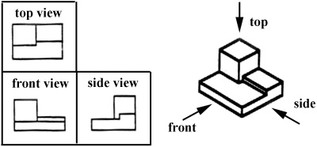

Gambar setiap sis menggambarkan secara detail objeknya. Ketiga gambar tersebut tidak semerta-merta digunakan semua. Contohnya gambar lingkaran dibawah. Gambar tersebut hanya membutuhkan 2 gambar sudah dapat mempresentasikan gambar keseluruhan.

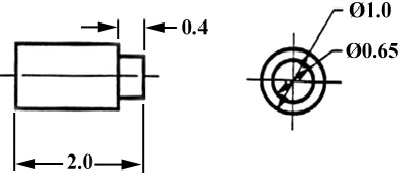

## Memberikan Dimensi

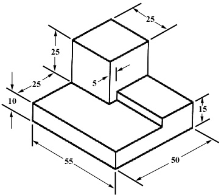

Telah diketahui pada gambar Isometrik ketika garis yang tidak paralel dengan sumbu tidak menggunakan nilai sebenarnya. Apabila gambar objek tersebut diberikan kepada pihak pekerja, maka pekerja memahami segala ukuran dari objek tersebut.

## *Sectioning*

Seperti objek yang memiliki objek lain didalamnya, terkadang tidak dapat digambarkan secara jelas.

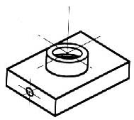

Agar objek didalamnya terlihat lebih jelas, maka perlu dibuka objek tersebut untuk melihatnya. Bayangkan sebuah objek terbelah dari bagian tengahnya. 

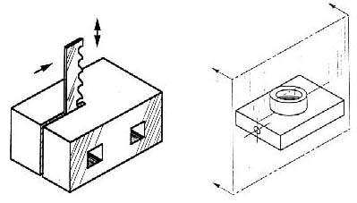
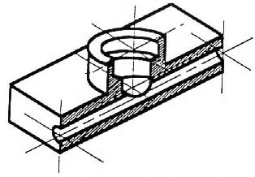

Maka akan terlihat seperti gambar 11

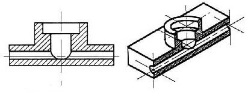

##  Gambar Pemasangan

Gambar isomterik dibawah adalah gambar sistem bearing pillow-block yang telah terpasang (Gambar 13). Apabila gambar tersebut diperhatikan, informasi didalam objek tersebut tidak terlihat.

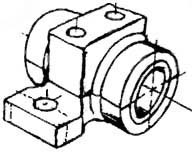

Di gamabar dibawah adalah gambar isometrik dari pillow-block yang dilepas atau disassembled. Dari gambar tersebut dapat diperhatikan jelas bagian dalamnya tapi tidak detail.

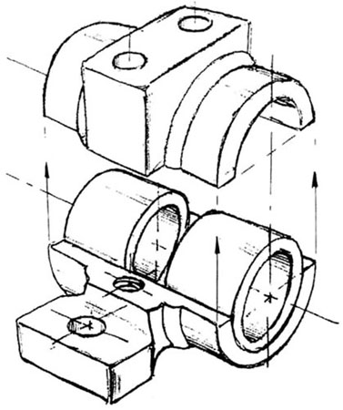

## Gambar Cross-Sectional

Gambar Vross-Sectional menggambarkan potongan dari bagian objek dan cara lain untuk menyampaikan komponen tersembunyi didalam perangkar.

Dapat dibayangkan suatu objek dipotong secara vertikal dari bagian tengah dari pillow block (gambar 15). Lalu dapat dibayangkan untuk fokus dengamemghilangkan bagian lain dapat digambarkan pada gamabar 16.

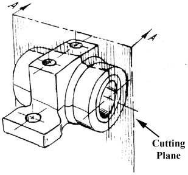

Gambar dibawah ini adalah bagian yang terlihat dari sisi yang terpotong. 

Gambar cross-sectional (gambar 17),  adalah gambar orthogonal dari arah potongan nya yang dapat mendeskripsikan nilai panjang dan diameter lebih baik.

## Dimensioning

Tujuan dari memberikan dimensi adalah memberikan informasi dari objek secara mendetail. Memberikan dimensi diharusnya mengikuti aturan aturan tertentu.

Akurasi: Nilai yg tertera harus benar.
Kebersihan: Dimensi diletakkan ke tempat yang benar
Ketepatan: Tidak ada yang kurang atau berlebih
Kemudahan Membaca: Menggunakan garis yang tepat

## Dimana Meletakan Dimensinya?

Memberikan dimensi harus diletakkan pada bagian depan yang mendeskripsikan obejek secara benar. Conthnya pada gambar 25

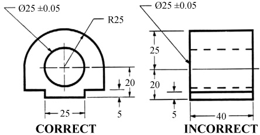

Untuk lebih mudah dalam menjelaskan tentang pemberian dimensi, perhatikan dari objek balok.  Dengan objek tersebut membutuhkan tiga dimensi untuk mendeskripsikan secara jelas dari objek nya (Gambar 26). 

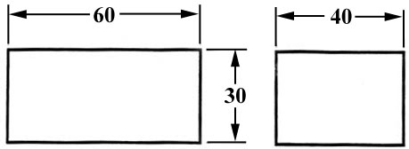

Apabila kotak tersebut dipotong disuatu bagian seperti gambar 27, maka banyak pilihan dimensi yang harus ditampilkan. Kebanyakan pengukuran  dimensi dilakukan pada garis atau sisi yang umum. Dimensi umum tersebut dinamai *datum line or surface*. *Datum line* mengurangi pengukuran tambahan atau tidak akurasi pembuatan objek. Dapat diperhatikan bagaimana dimensi yang memeiliki refrensi ke *datum surface*. Dapat diperhatikan *datum surface* pada gambar 27, dan yang lain pada gamabar 28.

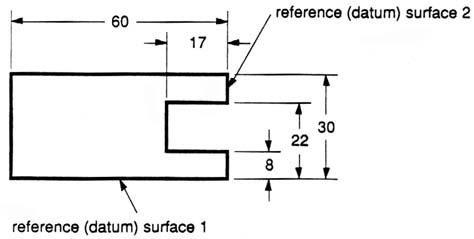
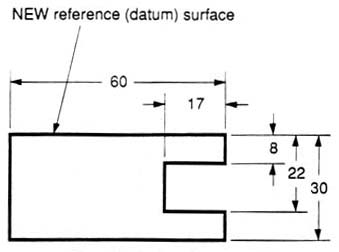

Pada gambar 29 diberikan lubang yang peletakan dimensinya dibagian kiri objek. Simbol Ø adalah simbol untuk diameter.

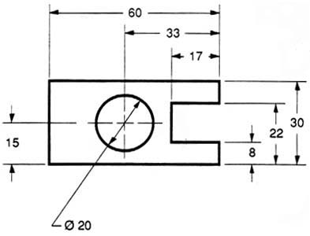

Ketika bagian kiri dari balok tersebut diberikan lengkung berdiameter seperti gambar 30, maka muncul duplikasi penempatan dimensi pada nilai lebar. Lebar balok telah diketahui karena nilainya sama karena nilai lebar sudah termasuk jari jari lengkungan. Lalu dengan memberikan (REF) untuk mengklarifikasi bahwa dimensi tidak begitu dibutuhkan.

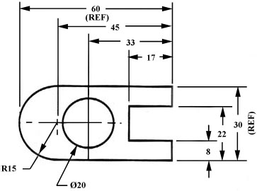

Disuatu tempat didalam lembar gambar harus diberikan informasi satuan yang digunakan dalam menggambar dan sekala yang digunakan.

Gambar tersebut bersifat simetris secara horizontal. Garis putus putus dibagian tengah digunakan untuk menandakan objek tersebut simetris termasuk lengkungan dan lubangnya. (Gambar 31). 

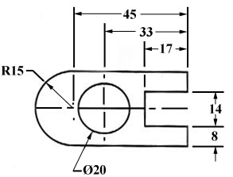

Berikut adalah daftar pembahasan pada Bab Modeling


# Sumber Materi
[^Daniel_frey]: Daniel Frey, and David Gossard. 2.007 Design and Manufacturing I. Spring 2009. Massachusetts Institute of Technology: MIT OpenCourseWare, https://ocw.mit.edu. License: Creative Commons BY-NC-SA.
